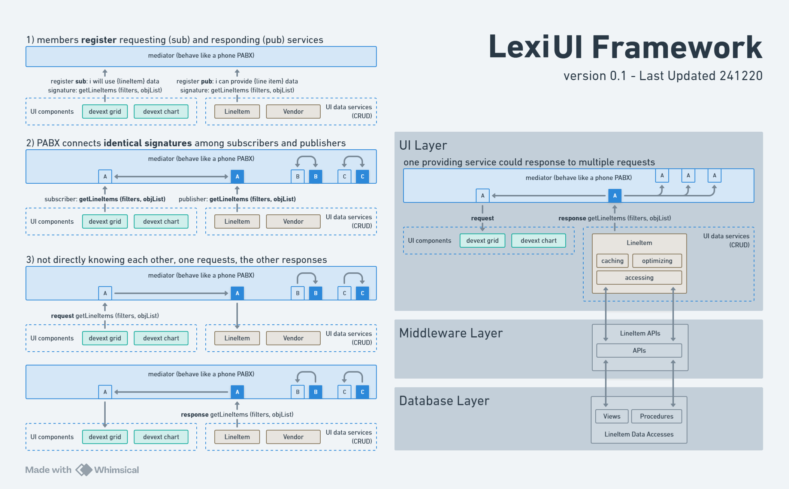

# lexi Client



Welcome to **lexi Client**! 🚀

**lexi Client** is a robust and scalable React-based application designed to deliver a seamless user experience through efficient state management and component communication. By leveraging the mediator pattern, **lexi Client** ensures modularity, maintainability, and high performance across various functionalities.

## Table of Contents

- [lexi Client](#lexi-client)
  - [Table of Contents](#table-of-contents)
  - [Introduction](#introduction)
  - [Features](#features)
  - [Tech Stack](#tech-stack)
    - [Frontend](#frontend)
    - [Backend](#backend)
    - [Containerization](#containerization)
  - [Architecture](#architecture)
    - [Key Components](#key-components)
  - [Getting Started](#getting-started)
    - [Prerequisites](#prerequisites)
    - [Frontend Setup](#frontend-setup)
    - [Backend Setup](#backend-setup)
      - [Setting Up SSH for GitHub](#setting-up-ssh-for-github)
        - [macOS/Linux](#macoslinux)
        - [Windows](#windows)
      - [Step 1: Start SQL Server Using Docker Compose](#step-1-start-sql-server-using-docker-compose)
      - [Step 2: Prepare the Database and Start the API Server](#step-2-prepare-the-database-and-start-the-api-server)
        - [macOS/Linux](#macoslinux-1)
        - [Windows](#windows-1)
      - [Step 3: Access the Swagger UI](#step-3-access-the-swagger-ui)
    - [Troubleshooting](#troubleshooting)
    - [Clean Up](#clean-up)
  - [Usage](#usage)
    - [Authentication](#authentication)
    - [Navigation Drawer](#navigation-drawer)
    - [Resizable Footer Logger](#resizable-footer-logger)
  - [Contributing](#contributing)
    - [How to Contribute](#how-to-contribute)
    - [Guidelines](#guidelines)
  - [License](#license)

## Introduction

**lexi Client** serves as the frontend framework that you can use for building any application. Built with React, it utilizes Material-UI and DevExtreme for styling and component design. The application employs the mediator pattern to facilitate efficient communication between components, enhancing scalability and reducing coupling.

To provide a comprehensive solution, **lexi Client** interacts with a backend API server (**lexi-Authen**) that handles authentication, role management, permissions, and other essential services. This integration ensures a secure and efficient workflow for managing user data and application states.


## Features

- **Responsive Design**: Delivers an optimal user experience across various devices and screen sizes.
- **Mediator Pattern Integration**: Enables decoupled communication between components, promoting modularity.
- **User Authentication**: Secure login and logout functionalities with JWT-based state management.
- **Role and Permission Management**: Comprehensive management of user roles and permissions.
- **Dynamic Content Rendering**: Seamlessly switches between different content sections like Home, Dashboard, Products, Account, Settings, and Feedback.
- **Resizable Footer Logger**: An interactive footer that logs events and displays component registries and Pub/Sub statuses.
- **Notification System**: Real-time notifications for authenticated users.
- **Persistent Drawer State**: Maintains the state of the navigation drawer (open/closed) across sessions.
- **Extensible Architecture**: Easily extendable subscription and publication specifications for enhanced functionality.
- **Secure Communication**: Implements JWT authentication to ensure secure data transmission between frontend and backend.

## Tech Stack

### Frontend

- **[React](https://reactjs.org/)**: JavaScript library for building user interfaces.
- **[Material-UI (MUI)](https://mui.com/)**: React UI framework for styling and components.
- **[DevExtreme](https://js.devexpress.com/)**: Comprehensive UI component suite for building feature-rich applications.

### Backend

- **[.NET SDK](https://dotnet.microsoft.com/download)**: Framework for building the backend API using C#.
- **[Entity Framework Core](https://docs.microsoft.com/en-us/ef/core/)**: ORM for database interactions.
- **[SQL Server](https://www.microsoft.com/en-us/sql-server/sql-server-downloads)**: Relational database management system.
- **[JWT Authentication](https://jwt.io/)**: Secure token-based authentication mechanism.

### Containerization

- **[Docker](https://www.docker.com/)**: Containerization platform for running the backend API server.

## Architecture

**lexi Client** adopts the **Mediator Pattern** to handle communication between various components, ensuring a loosely coupled architecture. This pattern centralizes event management, allowing components to interact without direct dependencies.

### Key Components

1. **MainPage**
   - Serves as the primary layout component.
   - Manages state for user authentication, drawer visibility, selected content, and more.
   - Integrates with the mediator to handle event-driven communication.
   - Renders various content sections based on user interactions.

2. **MediatorProvider**
   - Acts as the central hub for event subscriptions and publications.
   - Manages the registration and unregistration of components.
   - Handles the distribution of events to subscribed components.
   - Maintains an internal log for event tracking and debugging.

3. **Services**
   - **AuthenService**, **RoleService**, **PermissionService**, **UserService**, **UiitemService**, **UipermissionService**:
     - Handle specific domain-related operations.
     - Interact with respective APIs to manage data and state.
     - Communicate with other components via the mediator.

4. **UI Components**
   - **HeaderPage**, **LoginDialog**, **HamburgerMenu**, **NotificationIcon**, **AccountIconComponent**:
     - Provide interactive UI elements for user interactions.
     - Communicate user actions to the mediator for state updates.

## Getting Started

Follow the steps below to set up the **lexi Client** application locally, including both the frontend and backend components.

### Prerequisites

- **Node.js** (v14 or higher)
- **npm** or **yarn** package manager
- **Docker** (for backend setup)
- **.NET SDK** (for backend setup)
- **Git** (for version control)

### Frontend Setup

1. **Clone the Repository**

   ```bash
   git clone https://github.com/your-username/lexi-client.git
   cd lexi-client
   ```

2. **Install Dependencies**

   Using npm:

   ```bash
   npm install
   ```

   Or using yarn:

   ```bash
   yarn install
   ```

3. **Start the Development Server**

   Using npm:

   ```bash
   npm start
   ```

   Or using yarn:

   ```bash
   yarn start
   ```

   The application will run at `http://localhost:3000`.

### Backend Setup

The backend API server (**lexi-Authen**) handles authentication, role management, permissions, and other essential services. Follow the steps below to set up and run the backend server.

#### Setting Up SSH for GitHub

To clone the repository using SSH, you need to configure SSH access to GitHub. Follow the steps below tailored for both macOS and Windows users.

##### macOS/Linux

1. **Check for Existing SSH Keys**

   Open a terminal and run:

   ```bash
   ls -al ~/.ssh
   ```

   Look for files like `id_rsa` or `id_ed25519`. If they exist, you can skip the key generation step.

2. **Generate a New SSH Key (if needed)**

   If you don't have an SSH key, generate one:

   ```bash
   ssh-keygen -t ed25519 -C "your_email@example.com"
   ```

   - Replace `your_email@example.com` with your GitHub email address.
   - When prompted, press Enter to save the key to the default location (`~/.ssh/id_ed25519`).

3. **Add the SSH Key to Your SSH Agent**

   Start the SSH agent and add your key:

   ```bash
   eval "$(ssh-agent -s)"
   ssh-add ~/.ssh/id_ed25519
   ```

4. **Add the SSH Key to Your GitHub Account**

   - Copy your public key:

     ```bash
     cat ~/.ssh/id_ed25519.pub
     ```

   - Log in to your GitHub account and navigate to **Settings > SSH and GPG keys > New SSH key**.
   - Paste the copied key into the **Key** field, give it a title, and save.

5. **Test the SSH Connection**

   Test the connection to ensure everything is set up correctly:

   ```bash
   ssh -T git@github.com
   ```

   You should see a message like:

   ```
   Hi username! You've successfully authenticated, but GitHub does not provide shell access.
   ```

##### Windows

1. **Check for Existing SSH Keys**

   Open **Git Bash** or **PowerShell** and run:

   ```bash
   ls -al ~/.ssh
   ```

   Look for files like `id_rsa` or `id_ed25519`. If they exist, you can skip the key generation step.

2. **Generate a New SSH Key (if needed)**

   If you don't have an SSH key, generate one:

   ```bash
   ssh-keygen -t ed25519 -C "your_email@example.com"
   ```

   - Replace `your_email@example.com` with your GitHub email address.
   - When prompted, press Enter to save the key to the default location (`C:\Users\YourUsername\.ssh\id_ed25519`).

3. **Add the SSH Key to Your SSH Agent**

   Start the SSH agent and add your key:

   ```powershell
   # Start the SSH agent service
   Start-Service ssh-agent

   # Set the SSH agent to start automatically with Windows
   Get-Service ssh-agent | Set-Service -StartupType Automatic

   # Add your SSH private key to the SSH agent
   ssh-add ~\.ssh\id_ed25519
   ```

   *Note: Ensure you run PowerShell as an administrator to execute the above commands.*

4. **Add the SSH Key to Your GitHub Account**

   - Copy your public key:

     ```powershell
     Get-Content ~\.ssh\id_ed25519.pub
     ```

   - Log in to your GitHub account and navigate to **Settings > SSH and GPG keys > New SSH key**.
   - Paste the copied key into the **Key** field, give it a title, and save.

5. **Test the SSH Connection**

   Test the connection to ensure everything is set up correctly:

   ```bash
   ssh -T git@github.com
   ```

   You should see a message like:

   ```
   Hi username! You've successfully authenticated, but GitHub does not provide shell access.
   ```

#### Step 1: Start SQL Server Using Docker Compose

1. **Navigate to the Backend Directory**

   ```bash
   cd backend
   ```

2. **Ensure `docker-compose.yml` is Present**

   Verify that the `docker-compose.yml` file exists and contains the necessary configuration for SQL Server.

3. **Start the SQL Server Container**

   ```bash
   docker-compose up -d
   ```

4. **Verify the Container is Running**

   ```bash
   docker ps
   ```

   Ensure a container named `sqlserver` is listed and running.

#### Step 2: Prepare the Database and Start the API Server

Run the provided script to handle the following tasks automatically:

- Clone or update the repository using SSH.
- Drop the `LexiAuthenDB` database (if it exists).
- Delete the existing EF Core migrations.
- Create new EF Core migrations.
- Apply the migrations to set up the database schema.
- Build the backend API project.
- Start the API server.

##### macOS/Linux

1. **Make the Script Executable (Only Required Once)**

   ```bash
   chmod +x start-authen-api.sh
   ```

2. **Run the Script**

   ```bash
   ./start-authen-api.sh
   ```

##### Windows

1. **Run the Script**

   Open **Command Prompt** or **PowerShell**, navigate to the `backend` directory, and execute:

   ```cmd
   start-authen-api.bat
   ```

   *Alternatively, you can double-click the `start-authen-api.bat` file in File Explorer.*

Upon successful completion, the API server will be running in debug mode at:

- **HTTP**: `http://localhost:5108`
- **HTTPS**: `https://localhost:5001`

#### Step 3: Access the Swagger UI

The API server includes a **Swagger UI** for testing the available endpoints. You can access it by opening the following URL in your browser:

- **Swagger UI**: [https://localhost:5001/swagger](https://localhost:5001/swagger)

If you're running the server for the first time, your browser may show a security warning due to the self-signed SSL certificate. You can bypass this warning by proceeding to the site.

### Troubleshooting

1. **SSH Issues**:
   - Ensure your SSH key is correctly configured and added to your GitHub account.
   - Test the SSH connection with:

     ```bash
     ssh -T git@github.com
     ```

2. **Docker Container Not Running**:
   - Check that Docker is installed and running.
   - Use `docker logs sqlserver` to debug SQL Server container issues.

3. **SQLCMD Issues**:
   - Ensure the `sqlcmd` utility is installed and accessible in your `PATH`.
   - Verify SQL Server is running and accessible on port `1433`.

4. **EF Core Issues**:
   - If the database setup fails, ensure the SQL Server container is running.
   - Check the connection string in the script:

     ```bash
     Server=localhost;Database=LexiAuthenDB;User Id=sa;Password=YourNewStrong!Password;TrustServerCertificate=True;
     ```

5. **Script Permission Errors (macOS/Linux)**:
   - Ensure the script (`start-authen-api.sh`) has execute permissions:

     ```bash
     chmod +x start-authen-api.sh
     ```

6. **Script Execution Issues (Windows)**:
   - Ensure you are running the `.bat` file with sufficient privileges (e.g., as Administrator).

### Clean Up

To stop and remove the Docker container and its associated volumes, run:

```bash
docker-compose down -v
```

---

## Usage

Once the application is up and running, you can navigate through various sections:

- **Home**: Overview of the application.
- **Dashboard**: View and manage key metrics and data.
- **Products**: Browse and manage product listings.
- **Account**: Update user account settings.
- **Settings**: Configure application preferences.
- **Feedback**: Submit and view user feedback.

### Authentication

- Click on the **Login** button in the header to authenticate.
- Upon successful login, additional features like notifications and account management become available.

### Navigation Drawer

- Use the hamburger menu to toggle the navigation drawer.
- The drawer state (open/closed) is persisted across sessions.

### Resizable Footer Logger

- The footer logs events and displays component registries and Pub/Sub statuses.
- Drag the top edge of the footer to resize it as needed.

---

## Contributing

We love contributions from the community! Whether it's reporting bugs, suggesting features, or submitting pull requests, your help is greatly appreciated.

### How to Contribute

1. **Fork the Repository**

   Click the **Fork** button at the top right of the repository page to create your own fork.

2. **Clone Your Fork**

   ```bash
   git clone https://github.com/your-username/lexi-client.git
   cd lexi-client
   ```

3. **Create a Feature Branch**

   ```bash
   git checkout -b feature/YourFeature
   ```

4. **Commit Your Changes**

   ```bash
   git commit -m "Add your message here"
   ```

5. **Push to the Branch**

   ```bash
   git push origin feature/YourFeature
   ```

6. **Open a Pull Request**

   Navigate to the original repository and click **New Pull Request**. Describe your changes and submit the PR for review.

### Guidelines

- **Code Quality**: Ensure your code follows the existing coding standards and style.
- **Clear Commit Messages**: Write clear and concise commit messages that describe your changes.
- **Testing**: Include relevant tests for new features or bug fixes.
- **Documentation**: Update documentation as necessary to reflect your changes.
- **Respect the Community**: Be respectful and considerate in all interactions.

---

## License

This project is licensed under the [MIT License](LICENSE). You are free to use, modify, and distribute this software in accordance with the terms of the license.

---

**Thank you for using lexi Client!** If you encounter any issues or have suggestions, feel free to open an issue or reach out. Happy coding! 🎉
```

